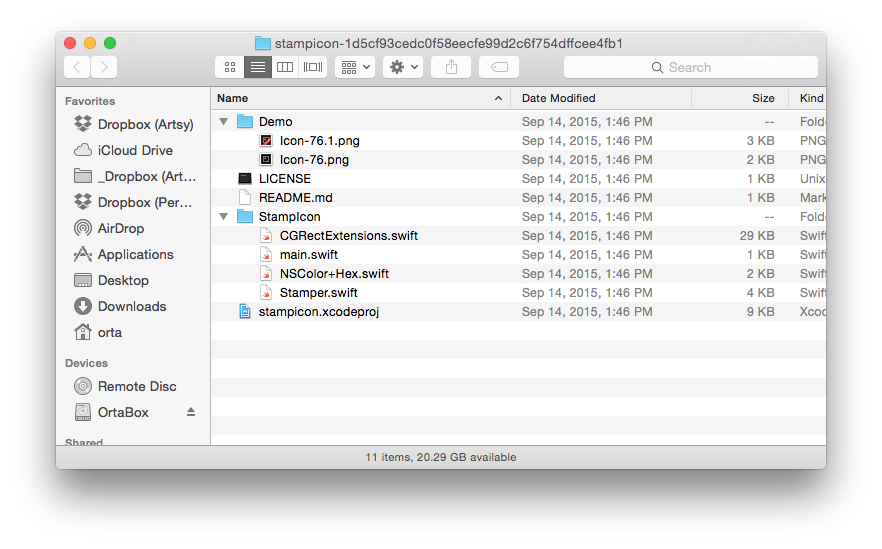
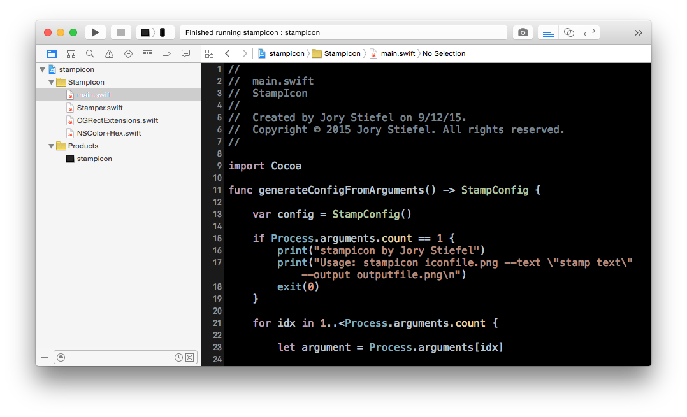

It's the last session for this set of Learn Swift at Artsy, we're going to break tradition here and move outside of the Playground to look at a real-world Xcode project.

### Overview of last week

In lesson four, we re-created a section of the Artsy API with structs and functions. We did this so we could replicate a section of the Artsy iOS app in the Xcode console. We didn't cover too many _new_ things, but instead tried to bring everything together to make a cohesive.

In this class we're going to look at a real project an iOS engineer at Artsy built. Jory didn't know we were going to use this as an example - so it's not a project made up for this lesson. Here's the problem it solves: We want to have different icons for betas, alphas and the app store. Doing this makes it easy to know which version of the app you have installed, when you have multiple installed on a device. So we want to have a way to add some text to an image, basically.

### Differences in Projects

We've always used Playgrounds as a way to write and experiment with our code. However you can't ship an app in a Playground. Given that this is a real app, we'll be using a real `xcodeproj` file.

The biggest difference is that now you have to press the play button in Xcode to make the code run, and that code gets separated into different files. OK. Let's grab the code.

Go to [github.com/jorystiefel/stampicon](https://github.com/jorystiefel/stampicon/tree/1d5cf93cedc0f58eecfe99d2c6f754dffcee4fb1) - and click "Download ZIP".

Open the zip file/folder and let's take a look.



So we have:

* `README.md` which is the project description
* `LICENSE` which is the project's license
* `Demo` is a folder with two images inside, I'm willing to bet this is Jory uses to test his app when building.
* `StampIcon` is a folder with all the source code for the app. If you note in the README he mentions that `NSColor+Hex.swift` and `CGRectExtensions.swift` are not his code.
* `stampicon.xcodeproj` - The file that represents the project, this keeps all the Xcode settings in a single place

OK, let's open the `xcodeproj`. It'll probably ask you if you want to update to the latest Swift, you can hit cancel. This was made for Swift 2.0, which is what we're using Xcode is just playing a little joke on us all ;)



OK, so now we have a file browser on the left instead of nothing. This is cool, we can use this to open `main.swift` which is the principal file in this app. It does all the work.

### Main.Swift

So this is a command line app. So you would use it in the terminal like so:


In Xcode you can see the output when you hit the play button in the top right, it will say:

```
stampicon by Jory Stiefel
Usage: stampicon iconfile.png --text "stamp text" --output outputfile.png

Program ended with exit code: 0
```

Basically letting us know that we need to pass some arguments to run the app. Let's see what's going in the code.

``` swift
import Cocoa
```

Cocoa is Apple's toolkit for making Mac apps, we need to use this to have access to some of Apple's objects like `Process` and `NSColor`.

We then have a function:

``` swift
func generateConfigFromArguments() -> StampConfig {

    var config = StampConfig()

    if Process.arguments.count == 1 {
        print("stampicon by Jory Stiefel")
        print("Usage: stampicon iconfile.png --text \"stamp text\" --output outputfile.png\n")
        exit(0)
    }

    for idx in 1..<Process.arguments.count {
```

Which will generate a thing called a `StampConfig`, we already know a lot of this syntax. We've see `for`, `if` and `print`. We don't know what `exit(0)` does, or really what `Process` is.

`exit(0)` is a way of forcing your application to close, nothing too fancy. One thing that does is make sure that no more code is ran within the application, so the `for` loop for example isn't ran at all if `Process.arguments.count == 1`.

`Process` comes from the Swift language and represents the process that your app is running in, think of it as a swimming lane that our app is swimming in. We want to look at how many things were passed in to our app from the command line, and `Process` gives us this information.

### Loops

Let's try unpack what we're seeing here. Jory is expecting that he would get an array like this:

```
var arguments = ["stampicon", "inputfile.png", "--output", "outputfile.png", "--text", "text to overlay"]
```

So this app want's to look through the arguments and then compare what they find, then use that to generate a configuration object. We'll use the above array as an example.

``` swift
for idx in 1..<Process.arguments.count {

    let argument = Process.arguments[idx]

    if idx == 1 {
        config.inputFile = argument
        continue
    }

    switch argument {
    case "--text":
        config.text = Process.arguments[idx+1]

    case "--output":
        config.outputFile = Process.arguments[idx+1]

    case "--font":
        config.fontName = Process.arguments[idx+1]

    case "--textcolor":
        config.textColor = NSColor(rgba: Process.arguments[idx+1])

    case "--badgecolor":
        config.badgeColor = NSColor(rgba: Process.arguments[idx+1])

    default:
        continue
    }
}
```

OK, so, this will loop through a list of numbers going from 1 to the number of arguments minus 1, which in our case is 6 and assign them to `idx` - short for Index. So 1, 2, 3, 4, 5.

Then we take that index, and pull out the string and call that `argument` with `let argument = Process.arguments[idx]`. Jory is using `let` here to inform others that this will never change.

Then the index is checked to see if it is the first one, and if so take the string and call set that as the `config`'s `inputFile`.

``` swift
if idx == 1 {
    config.inputFile = argument
    continue
}
```

It then uses `continue` to say, "now go on to the next thing in the `for` loop." So it will start again with `idx` being `2`.

So with `idx` as 2, it would go past that `if` and get to a `switch`. We've not looked at switches, so lets make a playground, and have a look.

You can make one in the current project by going to the menubar, Hitting `File` > `New` > `Playground`. Then making sure you choose OS X.

Then add this.

``` swift
var number = 1
switch number {
case 1:
    print("hi")
case 2:
    print("bye")
default:
    print("what?")
}
```

If you remember how a `Bool` can represent on and off, and then an `enum` can be the same kind of idea but with more states.

Well, we've been using an `if` to represent something being true or false. Then the equivilent for an enum is a `switch`, which represents multiple exclusive states.

A `switch` has to cover every possible state. So lets look at our example above. We make a switch on our variable `number`. Swift knows that `number` is a Int, so we can check the different types of Ints we know of. In this case, `1` and `2`. We can't just check for those though, because we have to represent _every_ Int. As this is pretty much impossible, we can use a thing called `default` to represent every state we have not covered.

We can do the same thing for `String`s.

``` swift
var string = "Hey"
switch number {
case "Hello":
    print("hi there")
case "Hi":
    print("hello to you")
default:
    print("what?")
}
```
This would print `what?` because we are not covering the string `"Hey"`.

OK, back to the code.

```Swift
switch argument {
case "--text":
    config.text = Process.arguments[idx+1]

case "--output":
    config.outputFile = Process.arguments[idx+1]

case "--font":
    config.fontName = Process.arguments[idx+1]

case "--textcolor":
    config.textColor = NSColor(rgba: Process.arguments[idx+1])

case "--badgecolor":
    config.badgeColor = NSColor(rgba: Process.arguments[idx+1])

default:
    continue
}

```

We're going to compare the `argument` var against a bunch of other strings. In this case we the argument is `"--output"` so it will get matched by:

``` swift
case "--output":
    config.outputFile = Process.arguments[idx+1]
```

This is great. This look in the arguments again and pick out the string that is after the current `idx + 1` - which is `outputfile.png`. This is then set as the `config`'s `outputFile`.

This loop then continues through the rest of the arguments and we should have a fully fleshed out `StampConfig` object which is returned from our function.

The rest of the code is relatively simple.

``` swift
var config = generateConfigFromArguments()
let stamper = Stamper(config: config)
stamper.processStamp();
```

We take the config, use it to create a `Stamper` struct, and then run a function on the stamper called `processStamp`. You can investigate that one in your own time though!

### Wrap-up

This was real code, used in an app that we use in Artsy. It is simple, readable and was not built for the purposes of being a demo app. You understand production code now. Your next step is looking [at Eidolon](https://github.com/artsy/eidolon) ;)

### Thanks

So first of all, for the people in the room, thanks for giving me 5 hours of your time. I learned a lot from this, and thing I think everyone else has gained a lot from your feedback too.

To people following along, I hope it's been valuable. You can reach out to me on twitter via [@orta](http://twitter.com/orta) or to the Artsy Dev Team via [@ArtsyOpenSource](http://twitter.com/ArtsyOpenSource) - if you don't have a twitter account and you are a developer, I would strongly recommend getting one.
