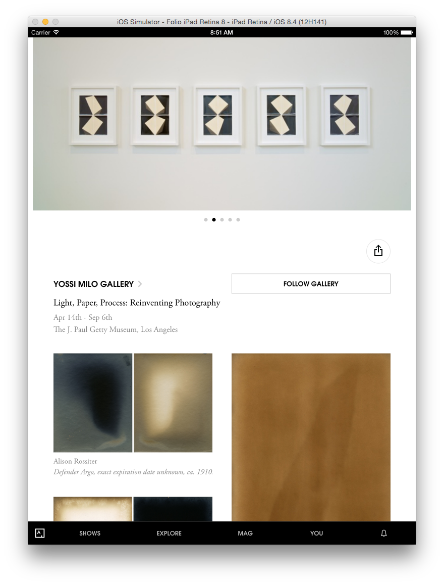
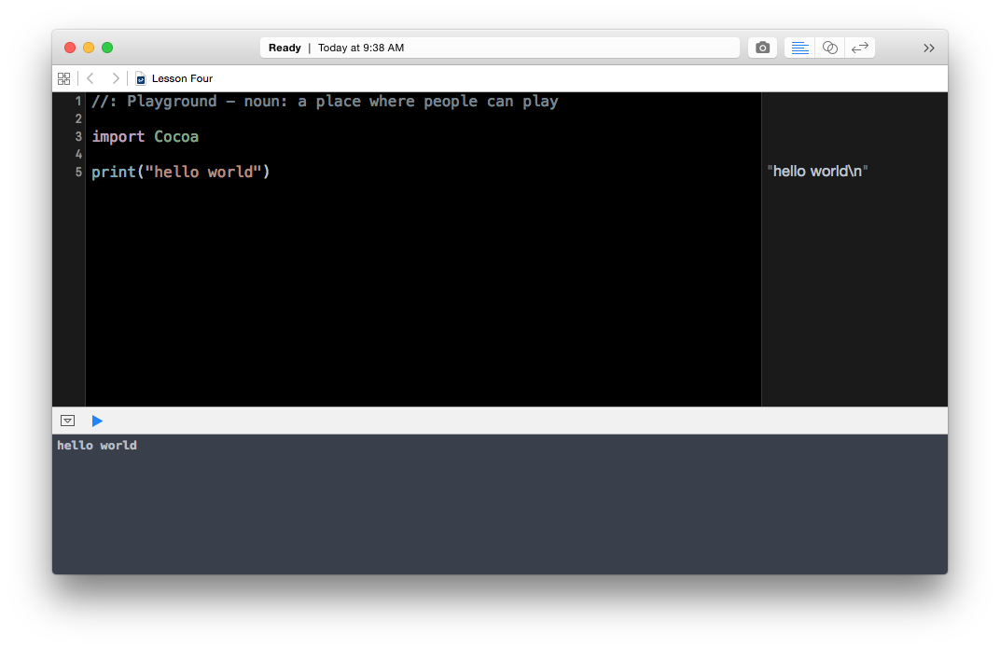
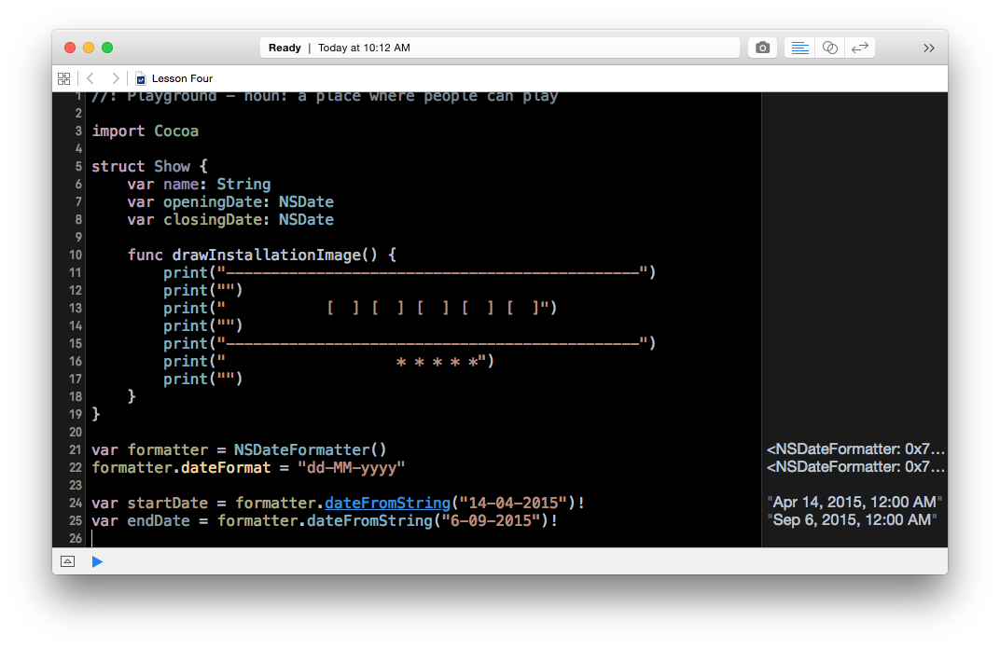
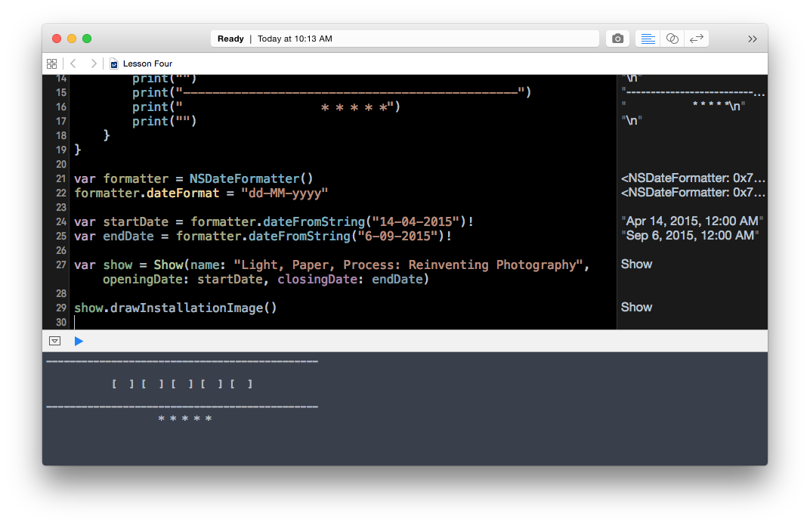
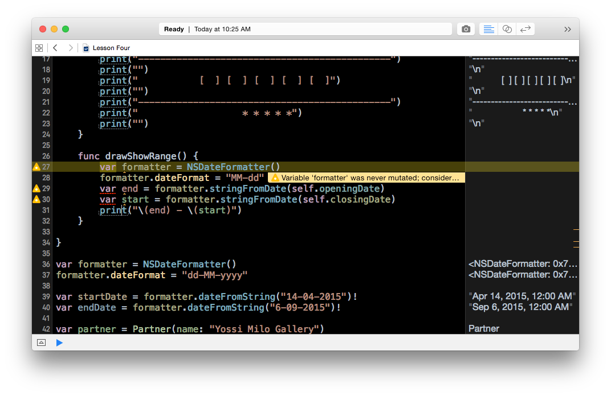

Great, lesson 4 - almost done!

### Overview of last week

In lesson three we expanded our knowledge of structs, and added a new language concept - functions. We created some blueprints for creating objects that could represent some real data. Then we showed how you can declare a chunk of code and give it a name, by using functions you can work with different levels of abstractions. We then moved on to applying a function to a struct blueprint so that we could use the same code in different places where we might use that object.

### Shows

We're going to have a really pragmatic lesson today. We know enough of the fundamentals now, that we can start replicating some of the Artsy iOS codebase. Notably, the shows page. This one from the [Yossi Milo Gallery](https://www.artsy.net/yossi-milo-gallery) - [Light, Paper, Process: Reinventing Photography](https://www.artsy.net/show/yossi-milo-gallery-light-paper-process-reinventing-photography)



Let's try and break down what we see here:

* We show installation shots at the top of the screen
* Under the install shots, there is a share this button
* Then the name of the Partner
* The name of the show
* The date range for the show
* The address of the show
* A follow gallery button
* A list of artworks, for each artwork we show:
  * The Artwork image
  * We'll skip the Artwork's Artist - call this homework if you'd like.
  * Artwork's name, and the date

So the aim of this lesson is that we have an ASCII image of the show page in the console in Xcode. In order to do this, we're going to represent all _images_ as text. The only thing we will *not* be doing, is having two columns of Artworks. Sorry. So we'll be aiming for something that looks a bit like this in the Xcode console:

```
----------------------------------------------

           [  ] [  ] [  ] [  ] [  ]

----------------------------------------------
                   * * * * *

                                     [ ^ ]
Yossi Milo Gallery          [ FOLLOW GALLERY ]
Light, Paper, Process: Reinventing Photography
Apr 14th - Sep 6th
The J.Paul Getty Museum, LA

	---------------------------------------
	[                                     ]
	[                                     ]
	[                                     ]
	---------------------------------------
	Defender Argo, 1910

	---------------------------------------
	[                                     ]
	[                                     ]
	[                                     ]
	[                                     ]
	[                                     ]
	---------------------------------------
	Anthony & Scoville, 1910

```

#### Xcode console

The Xcode console is a tool at the bottom of the playground, when you use `print` it will send that text to that logger section. You can access it either by pressing `cmd + shift + y` together or tapping the little square in the bottom left.



### The Show

Let's start with the Show object. We'll create a `struct` blueprint to represent the show:

``` swift
struct Show {
    var name: String
    var openingDate: NSDate
    var closingDate: NSDate
}
```

We're going to need a few more things:

* A way to draw the installation shot image
* A way to represent the Partner relationship
* A way to show the date range for the show
* A way to hold a collection of Artworks

We'll go through these incrementally. Let's look at a way to draw the installation image. We can use a function to draw the installation image.

``` swift
func drawInstallationImage() {
	print("----------------------------------------------")
	print("")
	print("           [  ] [  ] [  ] [  ] [  ]")
	print("")
	print("----------------------------------------------")
	print("                   * * * * *")
	print("")
}
```

This will print out the installation image once we call it. Let's move it on to the Show struct:

``` swift
struct Show {
    var name: String
    var openingDate: NSDate
    var closingDate: NSDate

    func drawInstallationImage() {
		print("----------------------------------------------")
		print("")
		print("           [  ] [  ] [  ] [  ] [  ]")
		print("")
		print("----------------------------------------------")
		print("                   * * * * *")
		print("")
	}
}
```

This is great. Let's see it in our console. To do that we have to make an instance of our Show. Because we have two dates, this is going to be a bit more complicated than normal. In order to have a date object we have to create a date formatter. A date formatter can create a date from some text.

``` swift
var formatter = NSDateFormatter()
formatter.dateFormat = "dd-MM-yyyy"
```

This says create a `NSDateFormatter` and give it a date format that makes sense. E.g. day-month-year. From here we can use the formatter variable to create dates for us, so let's make the start/end dates.

``` swift
var startDate = formatter.dateFromString("14-04-2015")!
var endDate = formatter.dateFromString("6-09-2015")!
```

Perfect, we even have the playground re-enforce that this worked right.

Let's just ignore the `!` at the end for now, it's likely we'll not go over this at all in our lessons. However if you want to learn more, check out [Swift Optionals](http://www.appcoda.com/beginners-guide-optionals-swift/)



Awesome. We have enough to create a `Show` now.

``` swift
var show = Show(name: "Light, Paper, Process: Reinventing Photography", openingDate: startDate, closingDate: endDate)
```

Finally, kick off `drawInstallationImage` function and check your console.



Great. We're getting there.

#### Partnerships

Let's look at the partner relationship. A Partner in Artsy could be a gallery, museum, auction, fair or more. We don't need to care too much about the [specifics](https://en.wikipedia.org/wiki/You_aren%27t_gonna_need_it), so lets just make a generic `Partner` `struct` that has a name. Note: this needs to go above the `Show` blueprint.

``` swift
struct Partner {
	var name:String;
}
```

That's all we need for this demo. We want to say that a show has a `Partner` so lets add a var to the `Show`.

``` swift
struct Show {
    var name: String
    var openingDate: NSDate
    var closingDate: NSDate
    var partner: Partner
    [...]
```

This will break our show at the bottom, because it now also needs a `Partner` object. Let's update that.

``` swift

var partner = Partner(name: "Yossi Milo Gallery")
var show = Show(name: "Light, Paper, Process: Reinventing Photography", openingDate: startDate, closingDate: endDate, partner: partner)

```

👍

### When does this finish?

Let's take a look at the date range. Let's create a function on the `Show` that creates a date range like we want to see.

``` swift
struct Show {
	[...]
    func drawShowRange() {
        var formatter = NSDateFormatter()
        formatter.dateFormat = "MM-dd"
        var end = formatter.stringFromDate(self.openingDate)
        var start = formatter.stringFromDate(self.closingDate)
        print("\(end) - \(start)")
    }
```

uh oh! Lots of yellow here.



So, we've been using `var` everywhere, because I want to re-enforce the "variables" idea. However, in Swift the language designers would prefer that you declare if a variable is going to change or not. In this case, we are not making changes to these variables so we should declare them using `let` instead. This tells other programmers that no-one will be making changes to this variable, so it represents only one thing and it will not change for as long as it exists.  

``` swift
struct Show {
	[...]
    func drawShowRange() {
        let formatter = NSDateFormatter()
        formatter.dateFormat = "MM-dd"
        let end = formatter.stringFromDate(self.openingDate)
        let start = formatter.stringFromDate(self.closingDate)
        print("\(end) - \(start)")
    }
```

Finally let's wrap up our work on the Show by adding an array of `Artwork`s. We can use our `Artwork` declaration from last week.

``` swift
struct Artwork {
    var name: String
    var medium: String
    var availability: String
    var date: String
}
```

Put this above the `Show` `struct` also. We want to make an array of `Artwork`s. This is pretty simple instead of writing `var artworks: Artwork` like you would for one artwork, you do `var artworks: [Artwork]` which implies it's a collection of `Artwork` objects.

``` swift
struct Show {
    var name: String
    var openingDate: NSDate
    var closingDate: NSDate
    var partner: Partner
    var artworks: [Artworks]
    [...]
```

This, again, will break our `Show(` function, so let's make two `Artwork` objects:

``` swift
var defender = Artwork(name: "Defender Argo", medium: "Print", availability: "For Sale", date: "1910")
var burke = Artwork(name: "Burke & James Rexo", medium: "Print", availability: "For Sale", date: "1910")
```

Next up we can fix our `Show(`:

``` swift
var show = Show(name: "Light, Paper, Process: Reinventing Photography", openingDate: startDate, closingDate: endDate, partner: partner, artworks: [defender, burke])
```

So we have put the two artwork objects created above, `defender` and `burke` in to the Show as an array using `[defender, burke]`.

OK, that's everything we need from the `Show`'s perspective. Let's devote some time to improving the output.

Let's think in objects. We want an object that represents the Show Page. This is the object that we can use to show things like the share button, or the follow gallery button. It is a higher level of abstraction above the Artwork. We're now dealing with a pure abstraction.

It's only going to need a `Show`. We'll use it to hold functions. Let's make a `printPage` function. Add this directly after the `Show` declaration.

``` swift
struct ShowPage {
	var show: Show

	func drawPage() {
		// do nothing
	}
}
```

Great. Let's make one at the bottom of our playground. Replacing

``` swift
show.drawInstallationImage()
show.drawShowRange()
```

with

``` swift
var showPage = ShowPage(show: show)
showPage.drawPage()
```

This removes all the console output, that's ok. We're going to start building it back up now. We should move the `show.drawInstallationImage()` into the `drawPage` function.

``` swift
struct ShowPage {
	[...]

	func drawPage() {
		self.show.drawInstallationImage()
	}
}
```

Perfect, now it's the role of the `ShowPage` to start piecing together our drawing!

Give the `ShowPage` a function to draw the share button`

``` swift
struct ShowPage {
	[...]

	func drawShareButton() {
		print("                                     [ ^ ]")
	}
}
```

Then call it from the `drawPage` function via `self.drawSharePage()`. Awesome. Next up is the partner name and the follow button. We'll make a function called `drawPartnerCallToAction` to display that.

``` swift
struct ShowPage {
	[...]

	func drawPartnerCallToAction() {
		print("\(self.show.partner.name)          [ FOLLOW GALLERY ]")
	}
}
```

and call that from the `drawPage` with `self.drawPartnerCallToAction()`. By this point your `drawPage` should look like:

``` swift
struct ShowPage {
	[...]

	func drawPage() {
		self.show.drawInstallationImage()
		self.drawShareButton()
		self.drawPartnerCallToAction()
	}
}
```

Which will echo out in the console something like this:

```
----------------------------------------------

           [  ] [  ] [  ] [  ] [  ]

----------------------------------------------
                   * * * * *

                                     [ ^ ]
Yossi Milo Gallery          [ FOLLOW GALLERY ]
```

Awesome. Next up, we want to print the show name. Append `print(self.show.name)` to the end of your `drawShow` function. The show availability date can be done with `self.show.drawShowRange()`. Finally to wrap up this section we want to add the partner's location. Let's quickly go add this in.

``` swift
struct Show {
    var name: String
    var location: String
    var openingDate: NSDate
    var closingDate: NSDate
    var partner: Partner
    var artworks: [Artwork]

	[...]
```

Note that the order is important. I put it next to name, as they feel closely linked, this means we have to add the location to the `Show(` call in the same place. This means our variable looks like:

``` swift
var show = Show(name: "Light, Paper, Process: Reinventing Photography", location: "The J.Paul Getty Museum, LA", openingDate: startDate, closingDate: endDate, partner: partner, artworks: [defender, burke])
```

Awesome, add the location to the `drawPage`. It should look like this:

``` swift
struct Show {
	[...]
    func drawPage() {
        self.show.drawInstallationImage()
        self.drawShareButton()
        self.drawPartnerCallToAction()
        print(self.show.name)
        self.show.drawShowRange()
        print(self.show.location)
    }
	[...]
```

Which prints out our header as expected!

All that's left is showing the artworks. We get to use the `for` statement that we used back in week one. Let's start out by printing the artworks name. Append this to the bottom of `drawPage`.

``` swift
for artwork in self.show.artworks {
    print(artwork.name)
}
```

We want to show artworks that have different heights. In order to do this we have to let an `Artwork` declare how many lines tall it is. Let's amend the `Artwork`.

``` swift
struct Artwork {
    var name: String
    var medium: String
    var availability: String
    var date: String
    var height: Int

	[...]
```

This breaks our artwork declarations below. So they should look like:

``` swift
var defender = Artwork(name: "Defender Argo", medium: "Print", availability: "For Sale", date: "1910", height: 3)
var burke = Artwork(name: "Burke & James Rexo", medium: "Print", availability: "For Sale", date: "1910", height: 5)
```

Now we can draw an artwork! Let's start by drawing the top and bottom of our artwork in the loop.

```swift
struct Show {
	[...]
    func drawPage() {
		[...]

		for artwork in self.show.artworks {
			print("	---------------------------------------")

			// draw the middle

			print("	---------------------------------------")
		   print(artwork.name)
		}

    }
	[...]

```

Now we want to figure out this "draw the middle bit". We want to draw `x` amount of lines, that correspond to the artwork's height. So let's use another for loop. This time using a range of from `0` to the artwork's height.

``` swift
	for _ in 0 ..< artwork.height {
		print("   [                                     ]")
	}
```

We're using the `_` to say that we don't want to do anything with the variable that the `for loop` gives us. With that in you should add an extra line of text before an artwork, and move the artwork name across to add up some polish. `drawPage` should look look like:

``` swift
struct ShowPage {
    var show: Show

    func drawPage() {
        self.show.drawInstallationImage()
        self.drawShareButton()
        self.drawPartnerCallToAction()
        print(self.show.name)
        self.show.drawShowRange()
        print(self.show.location)

        for artwork in self.show.artworks {
            print("")
            print("   ---------------------------------------")
            for _ in 0 ..< artwork.height {
                print("   [                                     ]")
            }
            print("   ---------------------------------------")
            print("   \(artwork.name)")
        }
    }
}
```

Check your console, we've done it.

That's it for today. We've not strictly learned any new things, but we've started to hopefully form connections between the things we have learned already and see how we can really model how we would build a page on Artsy with that knowledge.

### Overview

In lesson one, we learned about some of the primitives that Swift gives us. Mainly `Int`s and `String`s, and how to use an `if` and `for` to run different code paths.
In lesson two, we improved our primitive knowledge with Bools, and enums. Did a lot of `if` statements and some boolean algebra. Then started using `struct`s to represent ideas. In lesson three we talked about schools of thought for programming, then started looking at how we can give a collection of code a name - known as a function. Then we moved the code on to a struct to keep the code together logically.

In lesson four, we have

* Looked at drawing a page from the Artsy iOS app
* Connected a lot of objects and functions together to form a real-world use-case. Ish.

Why not take what we've learned, and add an `Artist` to an object. Then show the `Artist`'s name under an artwork in the playground?
