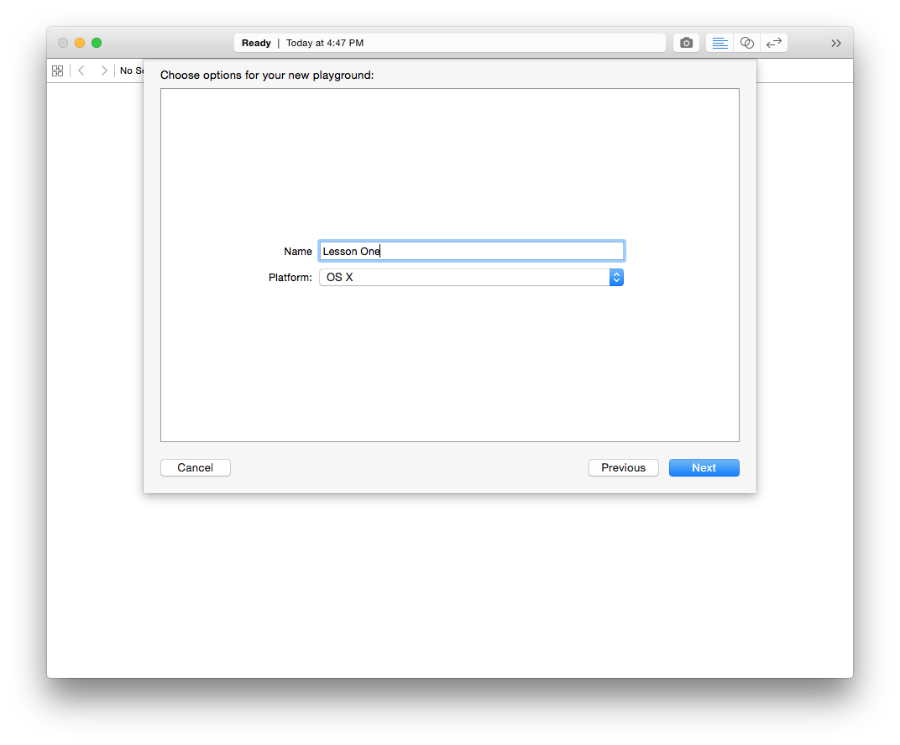
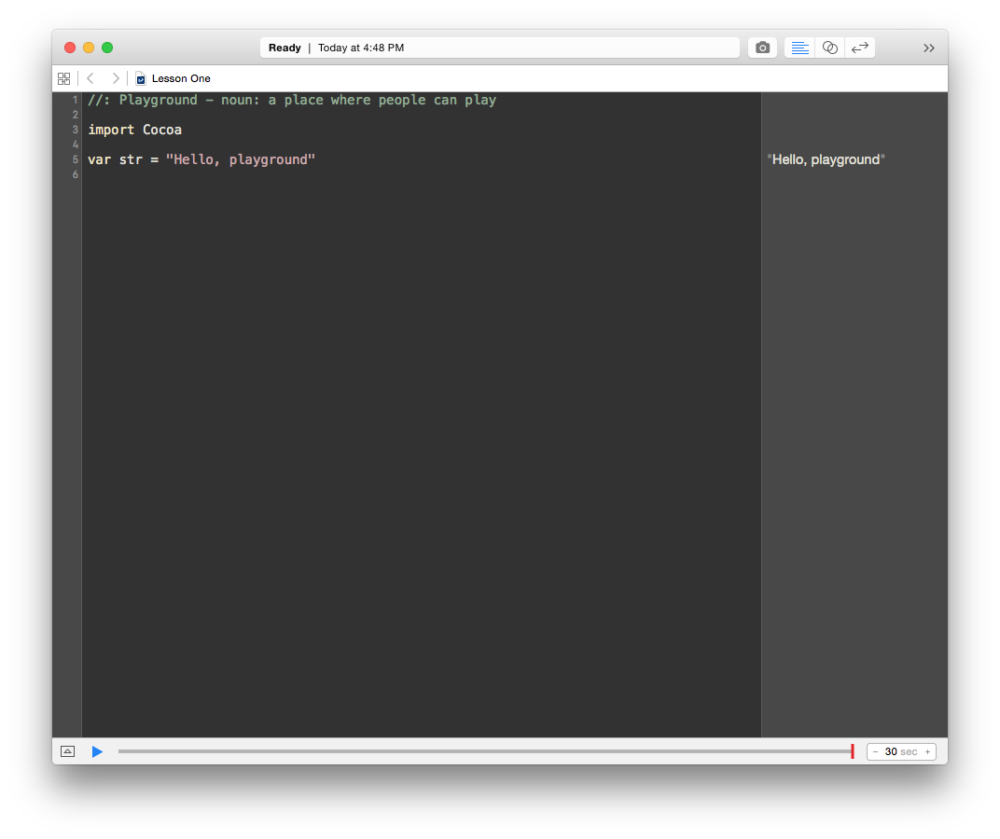

嘿！从学习编程的角度来看，我们接下来要学习Swift。这意味着你们提问难题而我试着去解释，这种编程方法类似肌肉记忆训练。这将会很有趣。

首先我们要搞清楚代码写在哪。我们窃以为你已经安装了Xcode 7。接下来咱们开始吧！

打开Xcode首先出现的是欢迎界面。


我们将使用*playgrounds*来学习Swift。点击“Get started with a playground”，起个名字，同时要保证platform设置为**OS X**。



很好。Xcode会为你创建并打开playground。就像这个样子。



左边比较大的区域是编写代码的地方。右边是代码运行的结果。你能看到左边已经写了一行代码，`var str = "Hello, playground"`，右边显示的输出结果为`"Hello, playground"`。简洁之至。

通常我们平时工作的代码需要编译成机器能理解的指令。我们只需牢记编译器是人和电脑交流的翻译。通常编译是很耗时的，如Eigen需要花5分钟编译。

我们将要使用Playgrounds，它能更快速的编写测试代码。它用到的技术为REPLs（反复的跟编译器交流）。

无论你作多大修改，Xcode立马编译运行，结果显示在右侧。当Xcode编译代码的时候，窗口顶头栏更改提示语为“Running”，并且显示一个小的等待菊花。

首先我们要搞清楚什么不是代码。你看第一行代码，为什么它是灰色的（具体颜色根据设置而定，比如我的是蓝色）？它其实是注释。注释是一种标柱，它告诉编译器我是不需要执行的。有时候我们使用注释，为了标记代码不执行或者添加一些说明用于以后提醒。

好了，让我们写些代码吧，输入以下代码。

```swift
1 + 2

1 /  2
1.0 / 2.0

"Hello, Artsy"
```
你能在右边看到结果：


编程里面我们想要使用抽象。所以创建我们第一个变量。变量拥有值，后续可以使用，你可以为它起任何（或者说几乎所有）你想要的名字。

变量是个抽象的概念，初学者一般需要花费一些时间去适应它。本质上，变量是存储某个地方的值并且后续你能找到它。有一些合理的原因解释为什么要这么做，其中最普遍的认识是我们需要多次引用该值。

我们将要做一个只有3个变量的简单的计算器。我想要做的是定义变量`a`和`b`，相加赋给变量`c`。这个例子很简单，但却能说明一些基础知识。

```swift
var a = 2
var b = 3

var c = a + b
```

该例中我们没有直接相加 `2` 和 `3` ，而是引入变量 `a` 和 `b` 。这是个简单的例子，当你有更多的编程经验后，你会适应它。

变量都有*类型*。有些是数字，有些是字符串，有些是其他类型。数字类型一般是`Int`，或者是一个整数（根本来说是约整数：1，2，3，－500，401）。Swift是 **强类型语言**，意味着类型很重要。Swift不会让你类型不明确。尽管我们没有*告诉*Swift变量类型，编译器会自动指明。

Swift中`:`指定类型。所以下面两行代码是一样的。

```swift
var myString = "Hello, Artsy"
var myString: String = "Hello, Artsy"
```

该例中我们处理字符集合，又叫字符串。该术语在其它编程语言中很常见，把它当成一串字符。

```swift
var myString: String = 1
```

Swift会警告`'Int' is not convertible to 'String'`。这是Swift编译时类型检查。它提前报告错误防治运行时产生bugs。Swift主要理念是运行安全。

编码的时候，我们经常需要打印一些有用的信息，用来验证某些代码是否运行了。所以让我们添加打印语句来看看`c`的值：

```swift
print(c)
```

代码正常运行后，我们可以加一些逻辑。我们想要看看`c`有多大，就像用英语表达，我们可以使用`if`语句：

```swift
if c > 6 {
    print("Pretty big c you got there.")
}
```

我们解释一下上面的代码。`if [something]` - `if`后面的语句检查`c`是否大于数字(`Int`) `6`。如果成立，那么执行大括号里的代码。

通常大括号中的内容会左缩进。尽管并不强制。

```swift
if c > 6 {
            print("Pretty big c you got there.")
}
```

```swift
if c > 6 { 
print("Pretty big c you got there.") 
}
```

```swift
if c > 6 { print("Pretty big c you got there.") }
```

我们需要重温另一个知识，那就是循环。循环即反复执行一段代码。让我们简单写一个，同样地，就像说英语。For a number in zero to c(英语就是这么说的，不用翻译)。

```swift
for number in 0...c {
    print("hi")
}
```

它跟`if`一样打印`hi`。它将执行`c`次大括号中的代码。每一次都打印`hi`。我想我们可以稍微的扩展下。这的`number`实际上是个变量，让我们让它更数学的表达，我们用`x`代替。

```swift
for x in 0...c {
    print("hi")
}
```

现在它是个变量，让我们打印它！

```swift
for x in 0...c {
    print(x)
}
```

循环是编程的基础。在上面的例子中，我们从`0`循环到`c`，当然你也可以循环其它变量。例如在Artsy我们做了个应用来展示一系列艺术品 - 我们遍历所有的艺术品展示在屏幕上。

如果你点击左下角小三角你能看到输出！

- - -

总结一下。

* 我们学了一点变量，它是名称标记，使用变量我们很容易想到它代表什么而不是它的值是什么。
* 接着我们学习了`字符串`，并且展示了一旦你定义了`字符串`类型，不能把它改成数字。
* 接着我们打印信息。
* 接着我们学习了`if`表达式，给我们的代码添加一些逻辑。
* 最后我们学习了`for in`循环。

如果你迫不及待，随便改playground。试着改循环内的代码看发生什么。是你预期的吗？为什么是或不是？

你认为这段代码会输出什么？

```swift
for number in 0...15 {
    if number > 5 {
        print("This is greater than five")
    }
}
```

这段呢？

```swift
for number in 0...15 {
    if number > 5 {
        print("This is greater than five")
    } else {
        print("This is less than five")
    }
}
```

你也可以观看斯坦福免费Swift教程：https://www.youtube.com/playlist?list=PLxwBNxx9j4PW4sY-wwBwQos3G6Kn3x6xP